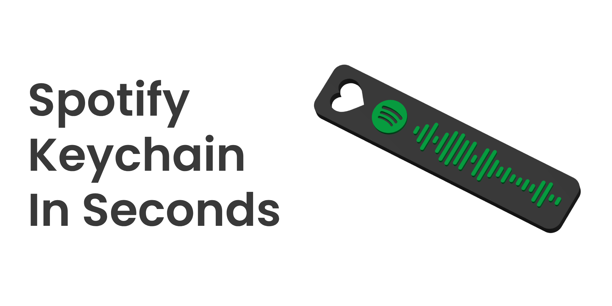

<a id="rm__top"></a>

<div align="center">
  <a href="#">
    
  </a>

  <h3 align="center">Spotify Keychain 3D Model Generator</h3>

  <p align="center">
   A beautifully designed and user-friendly 3D model generator for Spotify Keychains
    <br />
    <br />
    <a href="https://github.com/feenko/spotify-3d-keychain/issues">Report Bug</a>
    ·
    <a href="https://github.com/feenko/spotify-3d-keychain/issues">Request Feature</a>
    ·
    <a href="https://github.com/feenko/spotify-3d-keychain/pulls">Pull Request</a>
  </p>
</div>

<br>

<details>
<summary>Table of Contents</summary>

-   [About the Project](#about-the-project)
    -   [Built With](#built-with)
    -   [STEP File](#step-file)
-   [Getting Started](#getting-started)
    -   [Prerequisites](#prerequisites)
    -   [Installation](#installation)
-   [Roadmap](#roadmap)
-   [Contributing](#contributing)
-   [License](#license)
-   [Attribution](#attribution)

</details>

---

## About The Project

> [!IMPORTANT]
> This is a updated and more modern version of the [Spotify Keychain 3D Model](https://github.com/ricdigi/spotify_keychain_3D_model) generator.



This program generates a customized Spotify keychain with your favorite song, album, artist, or playlist code that you can scan and listen to the music directly from Spotify.

Previously, the original project was made by [ricdigi](https://github.com/ricdigi) and I decided to make a better as well as a more modern version of it.

Problems with the original was that there were no clear instructions on how to use the program and the design was not very user-friendly. Also previously, there was a compatibility issue with the package `NumPy` and `CadQuery` which has been fixed in this version.

### Built With

This project was built with the following technologies:

-   [Python 3.12](https://www.python.org/)
    -   [PySide6](https://pypi.org/project/PySide6/) _(6.7.2)_
    -   [CadQuery](https://pypi.org/project/cadquery/) _(2.4.0)_
    -   [Pillow](https://pypi.org/project/Pillow/) _(latest)_
    -   [NumPy](https://pypi.org/project/numpy/) _(1.26.4)_
    -   [Requests](https://pypi.org/project/requests/) _(latest)_

### STEP File

The STEP file is not made by me, but by [ricdigi](https://github.com/ricdigi) and all credits go to him.

<p align="right" style="font-size: 0.9rem;"><a href="#rm__top">Back to the top ↑</a></p>

## Getting Started

To start using the program, you need to follow the steps below.

### Prerequisites

-   [Python 3.12](https://www.python.org/) or higher
-   Pip (Python Package Installer)
-   Git (Optional)

### Installation

1. Clone the repository

    ```sh
    git clone https://github.com/feenko/spotify-3d-keychain.git
    ```

    or download the repository as a ZIP file and extract it.

2. Install the required packages

    ```sh
    pip install -r requirements.txt
    ```

3. Run the program
    ```sh
    # on Windows
    python main.py
    # on macOS
    python3 main.py
    ```

<p align="right" style="font-size: 0.9rem;"><a href="#readme-top">Back to the top ↑</a></p>

## Roadmap

-   [x] Develop the GUI interface
-   [x] Rewrite README.md
-   [ ] Fix compatibility issues
    -   [ ] macOS
    -   [ ] Linux

<p align="right" style="font-size: 0.9rem;"><a href="#readme-top">Back to the top ↑</a></p>

## Contributing

Contributions are what make the open-source community such an amazing place to learn, inspire, and create. Any contributions you make are **greatly appreciated**.

### Before you start

Before you plan to contribute to the project, please create an issue first and discuss the changes you would like to make. This will help to maintain a clean and organized project.

### Commit Messages

Please make sure to follow the [Conventional Commits](https://www.conventionalcommits.org/en/v1.0.0/) format for the commit messages. This will help to maintain a clean and readable commit history.

### Formatting

Please note that whole project is being formatted using [Black](https://github.com/psf/black) and [isort](https://github.com/PyCQA/isort). Make sure to run the following commands before making a pull request.

```sh
# Format the codebase using black
black .
# Sort the imports using isort
isort .
```

### Top Contributors

<a href="https://github.com/feneko/spotify-3d-keychain/graphs/contributors">
  
</a>

<p align="right" style="font-size: 0.9rem;"><a href="#readme-top">Back to the top ↑</a></p>

## License

Distributed under the MIT License. See `LICENSE` for more information.

<p align="right" style="font-size: 0.9rem;"><a href="#readme-top">Back to the top ↑</a></p>

## Attribution

This project includes the **Poppins** font, which is licensed under the [SIL Open Font License, Version 1.1](https://scripts.sil.org/OFL). The Poppins font was created by the Indian Type Foundry (ITF) and contributed to by Jonny Pinhorn.

For more information about the Poppins font, you can visit the [Google Fonts page for Poppins](https://fonts.google.com/specimen/Poppins).

<p align="right" style="font-size: 0.9rem;"><a href="#readme-top">Back to the top ↑</a></p>
